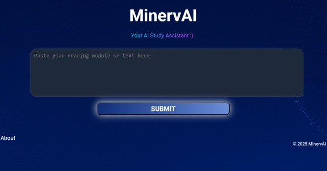
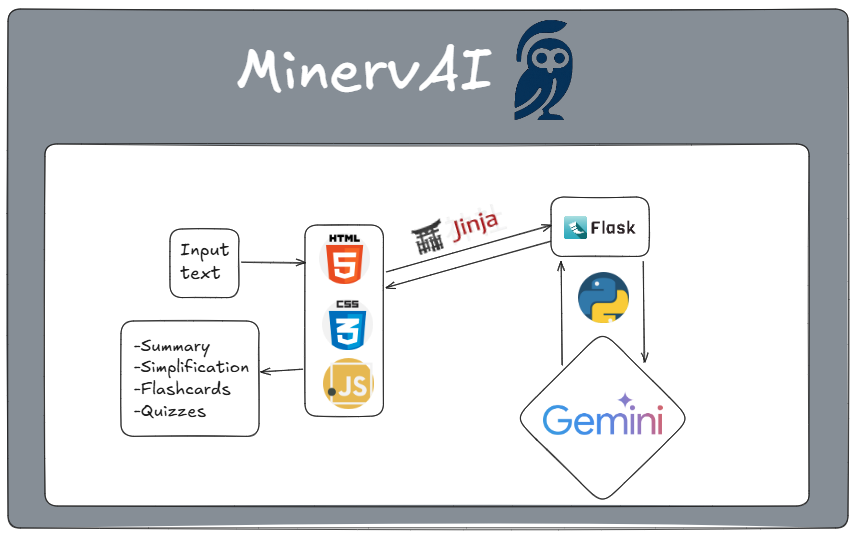

# 

# MinervAI

MinervAI, named after the Roman goddess of wisdom, is an educational web application designed to help users learn and test their knowledge through flashcards, quizzes, and summaries. 

## Features
- **Flashcards:** Create and review flashcards for efficient memorization.
- **Quizzes:** Take quizzes to test your understanding of various topics.
- **Summaries:** Generate concise summaries of learning materials.
- **About Page:** Learn more about the project and its creators.

## Project Structure
```
MinervAI/
├── app.py                  # Main application entry point
├── gemini_test.py          # AI integration and testing
├── README.md               # Project documentation
├── static/                 # Static assets (images, CSS)
│   ├── background.png
│   ├── MinervAI_favicon.png
│   ├── minervaiLogo.png
│   └── styles.css
├── templates/              # HTML templates for web pages
│   ├── about.html
│   ├── flashcards.html
│   ├── index.html
│   ├── quizzes.html
│   ├── results.html
│   └── summary.html
```

## Technologies Used
- Python (Flask)
- HTML, CSS, JavaScript
- AI integration (Gemini API)

# 

# 
